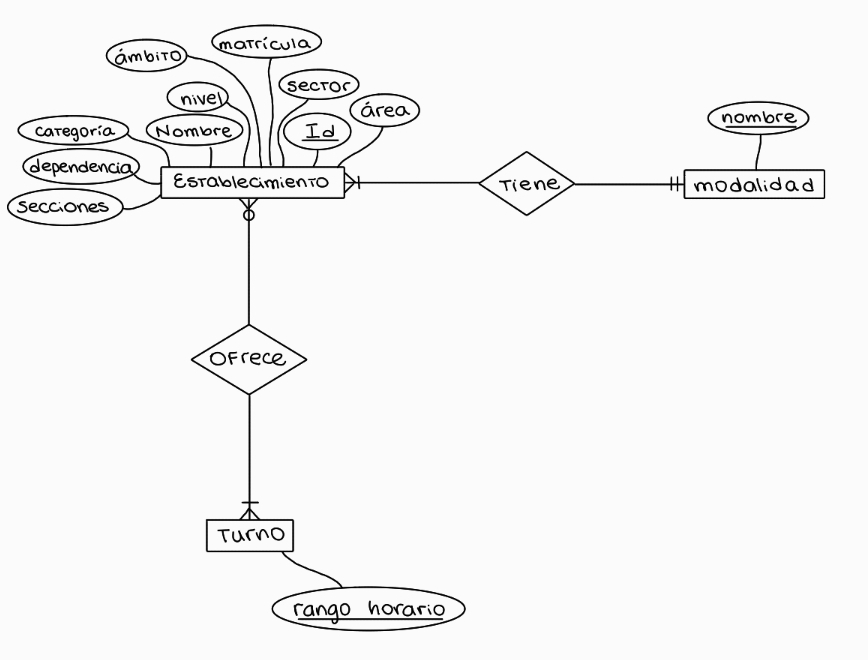
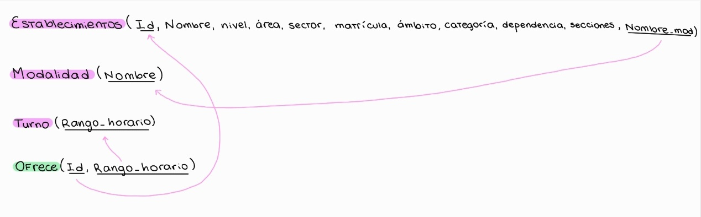

\newpage

### Introducción

Los resultados en este informe son el producto de un análisis de datos relacionados a la oferta de establecimientos educativos en la Provincia de Buenos Aires, utilizaremos el Dataset "Establecimientos educativos por modalidad y nivel", que proviene de datos abiertos del Gobierno de la Provincia de Buenos Aires, y se pueden encontrar en el siguiente enlace: <https://catalogo.datos.gba.gob.ar/dataset/establecimientos-educativos>.

Nos interesa analizar como varía la oferta de establecimientos dependiendo de distintas características, como por ejemplo para ciertas ubicaciónes, turnos o modalidades. También informaremos sobre como se conforman en general los establecimientos, cuantos alumnos tienen y la división de estos en distintas secciones.

En particular, nos interesa responder las siguientes preguntas:

A. ¿Cómo es la distribución de cantidad de establecimientos educativos en la PBA por categoría, área y ámbito?

B. ¿Existe alguna relación entre la matrícula y la cantidad de secciones de un establecimiento? ¿Qué ocurre si se analiza discriminando por modalidad, área, sector, etc.?

C. ¿Cuántos estudiantes y cuántas secciones tienen en promedio los establecimientos de una misma dependencia? ¿Cómo es la variabilidad? En especial, interesa analizar las dependencias que tengan más de 500 establecimientos bajo su órbita, mientras que el resto puede ser analizado en conjunto como una categoría “otro” (en referencia a otro tipo de dependencia).

D. ¿Cómo se caracteriza la oferta de turnos para cada uno de los niveles educativos? ¿Varía según área, sector y el tipo de dependencia?

### Metodología

Utilizamos como herramienta principal el lenguaje de programacion R, R markdown y ggplot2 para los gráficos.

Para responder las preguntas clave, creamos un `data.frame` llamado `datos` con las variables correspondientes a:

*Modalidad*: modalidad educativa (ejemplo: educación especial, común, etc.).

*Área*: refiere a si es conurbano o interior.

*Sector*: Ámbito de gestión del establecimiento (ejemplo: privado, estatal, etc.).

*Dependencia*: Jurisdicción de la que dependen normativamente (oficial, municipal, privada, nacional, u otros organismos).

*Ámbito*: Refiere a si es ámbito urbano, rural disperso, rural agrupado, o itinerante.

*Categoría*: Clasificación según pautas de organización y otras características de los niveles educativos (existen establecimientos de primera, segunda, y tercera categoría).

*Secciones*: Cantidad de grupos escolares organizados (pueden pensarlo como cantidad de cursos por escuela).

*Matrícula*: Cantidad de alumnos registrados en una unidad educativa.

*Turnos*: Jornadas escolares durante las cuales opera el establecimiento (ejemplo: mañana, tarde, vespertino, etc.).

*Nivel*: Nivel educativo (ejemplo: inicial, primario, secundario, etc.).

*Dependencia*: Jurisdicción de la que dependen normativamente (ejemplo: municipal, nacional, etc.).

```{r, include=FALSE}
library(dplyr)
library(ggplot2)
library(kableExtra)

datos <- read.csv("establecimientos_educativos.csv", header = T, sep=",", dec=".")

datos <- datos %>%
  select(establecimiento_id, establecimiento_nombre, modalidad, nivel, sector, dependencia, categoria, area, ambito, matricula, secciones, turnos)

```

Obtenemos el data frame con los datos sobre los establecimientos educativos, y vemos si hay datos faltantes:

Contamos como datos faltantes todos los casilleros que esten vacíos o que digan S/Datos, además, los turnos que incluyen "SIN INFORMACIÓN" y las secciones con numero 0, ya que lo tomamos como dato vacío, pues en el caso de no estar dividido por secciones, se lo considera con 1 sección.

```{r, echo=FALSE}
datos_faltantes <- colSums(is.na(datos) |
                             datos == "S/Datos" | 
                             datos == "MAÑANA,\"SIN INFORMACIÓN\",TARDE" | 
                             datos == "MAÑANA,\"SIN INFORMACIÓN\",TARDE,VESPERTINO" | 
                             datos == "MAÑANA,NOCHE,\"SIN INFORMACIÓN\",TARDE" | 
                             datos == "MAÑANA,NOCHE,\"SIN INFORMACIÓN\",TARDE,VESPERTINO" | 
                             datos == "MAÑANA,\"SIN INFORMACIÓN\"" | 
                             datos == "\"SIN INFORMACIÓN\",TARDE,VESPERTINO" | 
                             datos == "\"SIN INFORMACIÓN\",VESPERTINO" | 
                             datos == "NOCHE,\"SIN INFORMACIÓN\",TARDE" | 
                             datos == "ALTERNADO,\"SIN INFORMACIÓN\""| 
                             datos == "\"SIN INFORMACIÓN\"")

datos_faltantes["secciones"] <- sum(datos$secciones == 0)

knitr::kable((datos_faltantes), caption = "Datos faltantes")
```

Podemos ver que en turnos y especialmente en categoría y secciones tenemos muchos datos faltantes, esto puede generar problemas en el momento de analizar los datos que nos interesan, ya que la información que obtengamos será más propensa a tener errores o problemas de exactitud.

#### Parte A. 

Creamos un DER con los datos que vamos a utilizar para visualizar como se relacionan e interactúan las entidades entre sí.

{width=60%}

Suponemos que:

- Para cada modalidad debe existir al menos un establecimiento que tenga este tipo.

- Todo establecimiento debe ofrecer al menos un turno.

El mapeo del DER al modelo relacional se adjunta también a continuación:

{width=70%}

------------------------------------------------------------------------

#### Parte B.

### Pregunta A. Distribución en la cantidad de establecimientos

```{r, echo = FALSE}
cant_establecimientos_categoria <- datos %>% #cantidad de establecimientos en función de la categoría
  group_by(categoria) %>%
  summarise(count=n())

cant_establecimientos_area <- datos %>% #cantidad de establecimientos en función del area
  group_by(area) %>%
  summarise(count=n())

cant_establecimientos_ambito <- datos %>% #cantidad de establecimientos en función del ámbito
  group_by(ambito) %>%
  summarise(count=n())

```

A partir de los datos que tenemos, creamos gráficos que nos muestren la información.

```{r, echo = FALSE, fig.width=4, fig.height=3}
ggplot(data = cant_establecimientos_categoria, mapping = aes(x = "", y = count, fill = categoria)) + 
  geom_bar(stat = "identity", width = 1, color = "white") +
  coord_polar("y", start = 0) +
  theme_void() +
  labs(title = "Cantidad de establecimientos por categoría", fill = "Categoría")

```

```{r, echo = FALSE, fig.width=4, fig.height=3}
ggplot(data = cant_establecimientos_area, mapping = aes(x = "", y = count, fill = area)) +
  geom_bar(stat = "identity", width = 1, color = "white") +
  coord_polar("y", start = 0) +
  theme_void() +
  labs(title = "Cantidad de establecimientos por área", fill = "Área")

```

```{r, echo = FALSE, fig.width=4, fig.height=3}
ggplot(data = cant_establecimientos_ambito, mapping = aes(x = "", y = count, fill = ambito)) +
  geom_bar(stat = "identity", width = 1) +
  coord_polar("y", start = 0) +
  theme_void() +
  labs(title = "Cantidad de establecimientos por ámbito", fill = "Ámbito") +
  scale_fill_manual(values = c("Itinerante" = "black", "Rural Agrupado" = "gold", "Rural Disperso" = "turquoise", "Urbano" = "plum"))
```

Vemos que en el caso de la cantidad de establecimientos según la categoría, tenemos una mayoría de Primera categoría, seguido de cerca por la segunda y la tercera; sin embargo, vemos que los datos faltantes son una cantidad considerable respecto a los demás datos, estos pueden marcar una gran diferencia en el análisis ya que podrían revertir los resultados que obtuvimos.

En el caso del área, podemos ver una mayor cantidad de establecimientos en el interior, si bien es una diferencia significativa, podría ser aún mayor.

En el gráfico por ámbito podemos ver algo diferente a lo nombrado en los dos anteriores: hay un contraste muy grande entre los valores, ya que la mayoría de los establecimientos están en el ámbito urbano, mientras que podemos ver una linea casi imperceptible para Itinerante, que nos marca que hay muy pocos lugares que cumplen esta condición. Si vemos la tabla:

```{r, echo = FALSE}
knitr::kable((cant_establecimientos_ambito), caption = "Cantidad de establecimientos por ámbito")
```

Vemos el porque del gráfico, hay tan solo 14 establecimientos educativos Itinerantes, mientras que urbanos, hay mas de 18.000.

#### Pregunta B. Relación entre matrícula y cantidad de secciones

Para determinar las relaciones entre la matrícula y la cantidad de secciones discriminando por modalidad, área y sector, fueron omitidos los siguientes 3 casos donde la matrícula es mayor a 4000 para poder comprender mejor la información proporcionada:

```{r, echo=FALSE}
datos_matricula_omitidos <- datos %>%
  filter(matricula >= 4000) %>%
  select(establecimiento_id, modalidad, sector, dependencia, categoria, area, ambito, matricula, secciones)

knitr::kable((datos_matricula_omitidos), caption = "Datos omitidos con matrículas mayores a 4000") %>%
  kable_styling(font_size = 7)
```

```{r, echo = FALSE}
# creamos un nuevo data frame sin los datos 0 en secciones
secciones_sin_NA <- datos %>%
  filter(secciones != 0)
```

```{r, echo=FALSE, fig.width=6, fig.height=3}
ggplot(data = secciones_sin_NA, mapping = aes(x = matricula, y = secciones)) + 
  geom_point(alpha = 0.3, color = "blue") +
  labs(
    title = "Relación entre matrícula y cantidad de secciones",
    x = "Matrícula",
    y = "Secciones")

promedio_matricula_secciones <- secciones_sin_NA %>%
  summarise(Promedio = mean(matricula)/mean(secciones))
```

El promedio de la relación es `r promedio_matricula_secciones` matrículas por cada sección.

Podemos ver que la relación entre ambos parece lineal, es decir, mientras mas matrícula (número de estudiantes), más secciones.


```{r, echo=FALSE, fig.width=8}
datos_matricula_filtrados <- secciones_sin_NA %>%
  filter(matricula < 4000)

ggplot(data = datos_matricula_filtrados, mapping = aes(x = matricula, y = secciones, color = modalidad)) +
  geom_point(alpha = 0.2) +
  facet_wrap(~modalidad) +
    labs(
    title = "Matrícula y cantidad de secciones discriminado por modalidad",
    x = "Matrícula",
    y = "Secciones")

```

Si bien todos los gráficos siguen la misma linealidad, podemos ver ciertas diferencias: la modalidad de Psicología Comunitaria y Pedagogía Social no hay establecimientos con mucha cantidad de matrícula o secciones. Además, podemos ver una linealidad más clara en el caso de Educación Técnico Profesional y Educación Física, y más disperso en el caso de Educación de Jóvenes y Adultos, Educación Común y Educación Artística, lo que implica que no es tan real la afirmación "a más matrícula, mayor número de secciones"

```{r, echo=FALSE, fig.width=6, fig.height=3}
ggplot(data = datos_matricula_filtrados, mapping = aes(x = matricula, y = secciones, color = area)) + 
  geom_point(alpha = 0.3) +
  labs(
    title = "Matrícula y cantidad de secciones discriminado por área",
    x = "Matrícula",
    y = "Secciones") +
    facet_wrap(~area)

```

En este caso podemos ver que ambas relaciones son muy parecidas, esto tiene sentido ya que haíamos visto que la diferencia entre la cantidad de establecimientos en el Conurbano y en el Interior no era tanto.

```{r, echo=FALSE, fig.width=6, fig.height=3}
ggplot(data = datos_matricula_filtrados, mapping = aes(x = matricula, y = secciones, color = sector)) + 
  geom_point(alpha = 0.3) +
  labs(
    title = "Matrícula y cantidad de secciones discriminado por sector",
    x = "Matrícula",
    y = "Secciones") +
    facet_wrap(~sector)

```

En este último podemos ver que la cantidad de matrículas y de secciones en el caso de establecimientos privados es significativamente menor que en los establecimientos estatales.

#### Pregunta C.

Para responder esta pregunta utilizamos un diseño de tipo violin que nos permite ver cuando hay más cantidad de casos. El punto celeste nos índica el promedio, igualmente dejamos este último a continuación, incluyendo el desvío.

```{r, echo = FALSE}
conteo_dependencia <- secciones_sin_NA %>%
  count(dependencia, name = "cantidad")

datos_con_categorias <- secciones_sin_NA %>%
  left_join(conteo_dependencia, by = "dependencia") %>%  #Nos permite agregar la cantidad de establecimientos con esa dependencia para filtrar mas facil despues.
  mutate(dependencia_grupo = if_else(cantidad < 500, "Otro", dependencia)) #Filtramos con un if else y le agregamos la columna del grupo asignado

promedios <- datos_con_categorias %>%
  group_by(dependencia_grupo) %>%
  summarise(
    cantidad = n(),
    estudiantes = sum(matricula),
    total_secciones = sum(secciones),
    promedio_matricula = mean(matricula),
    desvio_matricula = sd(matricula),
    promedio_secciones = mean(secciones),
    desvio_secciones = sd(secciones) 
  )
```

```{r, echo = FALSE}
desvio_y_promedio_matricula <- tibble(
  dependencia = promedios$dependencia_grupo,
  promedio = promedios$promedio_matricula,
  desvio = promedios$desvio_secciones
)

desvio_y_promedio_secciones <- tibble(
  dependencia = promedios$dependencia_grupo,
  promedio = promedios$promedio_secciones,
  desvio = promedios$desvio_secciones
)
```

```{r, echo = FALSE}
knitr::kable((desvio_y_promedio_matricula), caption = "Promedio y desvío de estudiantes respecto a la dependencia")
```


```{r, echo = FALSE, fig.width=4, fig.height=3}
ggplot(data = datos_con_categorias, mapping = aes(x = dependencia_grupo, y = matricula)) +
  geom_violin() +
  geom_point(data = promedios, mapping = aes(x = dependencia_grupo, y = promedio_matricula), color = "skyblue", size = 3) +
  labs(
    title = "Relación entre estudiantes y dependencia",
    x = "Dependencia",
    y = "Estudiantes") 

```

Con esto ya podemos ver ciertas diferencias y similitudes, pero lo agrandamos para ver mejor la variabilidad, en este caso los datos con mayor matrícula no serán tomados en cuenta.


```{r, echo = FALSE, warning=FALSE, fig.width=4, fig.height=3}
ggplot(data = datos_con_categorias, mapping = aes(x = dependencia_grupo, y = matricula)) +
  geom_violin() +
  ylim(0, 2000) + 
  geom_point(data = promedios, mapping = aes(x = dependencia_grupo, y = promedio_matricula), color = "skyblue", size = 3)  +
  labs(
    title = "Relación entre estudiantes y dependencia (agrandada)",
    x = "Dependencia",
    y = "Estudiantes") 
```

Detectamos que todos los tipos de dependencia tienen una mayor cantidad de casos con pocos estudiantes (menos de 1.000), y en especial los que tienen menos de 500 establecimientos son los que tienen los lugares con mayor cantidad de alumnos.
Sin embargo, podemos notar diferencias (en el segundo gráfico podemos apreciarlo mejor), por ejemplo, en las dependencias "oficial" podemos ver una decandencia en la cantidad de establecimientos con una cantidad x de alumnos a medida que este número se hace más grande, a diferencia de "otro", donde podemos ver una cantidad muy centrada alrededor de 250 estudiantes aproximadamente, y una variación en la "privada".
Siendo que podemos ver claramente las diferencias entre la variacion de las dependencias, todos los promedios son muy cercanos entre sí, por esta razón es interesante ver otros datos además de este: el desvío nos muestra que los datos no son tan similares como parecen a primera vista.

--------------------------------------

Ahora hacemos lo mismo para secciones: 
Tenemos en cuenta que todos los datos vacios de 0 secciones no están siendo utilizados para el gráfico ni para el cálculo.

```{r, echo = FALSE}
knitr::kable((desvio_y_promedio_secciones), caption = "Promedio y desvío de secciones respecto a la dependencia")
```

```{r, echo = FALSE, fig.width=4, fig.height=3}
ggplot(data = datos_con_categorias, mapping = aes(x = dependencia_grupo, y = secciones)) +
  geom_violin() +
  geom_point(data = promedios, mapping = aes(x = dependencia_grupo, y = promedio_secciones), color = "skyblue", size = 3) +
  labs(
    title = "Relación entre secciones y dependencia",
    x = "Dependencia",
    y = "Secciones")
```

Antes de analizar hagamos lo mismo que antes: Agrandemos.

```{r, echo = FALSE, warning=FALSE, fig.width=4, fig.height=3}
ggplot(data = datos_con_categorias, mapping = aes(x = dependencia_grupo, y = secciones)) +
  geom_violin() +
  ylim(0, 100) + 
  geom_point(data = promedios, mapping = aes(x = dependencia_grupo, y = promedio_secciones), color = "skyblue", size = 3)  +
  labs(
    title = "Relación entre secciones y dependencia (agrandada)",
    x = "Dependencia",
    y = "Secciones") 
```

Para este gráfico podemos ver más variación ya que para la cantidad de secciones se maneja un número mucho más reducido que en el caso de estudiantes, pero podemos ver que en las 3 dependencias la mayoría de los establecimientos tienen menos de 25 secciones, y mientras en oficial también podemos ver una disminución a medida que la cantidad de secciones aumenta, en el caso de otro vemos una tendencia clara a los establecimientos con 6 secciones o menos, y para el caso de la privada hay más variación tendencia a dos números de secciones.

#### Parte C.

### Ej 4.

Para responder la pregunta "¿Cómo se caracteriza la oferta de turnos para cada uno de los niveles educativos? ¿Varía según área, sector y el tipo de dependencia?", procederíamos primero armando una tabla que exponga la oferta total para cada nivel. Como un establecimiento puede ofrecer varios turnos y varios niveles (debido a que en el DER puede observarse que tanto la relación "ofrece" entre las entidades "establecimiento" y "turno" es "de muchos a muchos"), la observación que debería aparecer, para cada nivel, es la cantidad total de establecimientos que están relacionados simultáneamente con ese nivel y con el respectivo turno.


Luego, haríamos lo mismo pero discriminando por área, sector y, finalmente, el tipo de dependencia. Como estos últimos son atributos de la entidad "establecimiento" en el DER, tendremos que dividir la tabla por cada valor que puede tomar ese atributo. Por ejemplo, si miramos por área, tendremos dos valores posibles: conurbano e interior. Por lo tanto, haríamos una tabla en la que miraríamos el ofrecimiento de turnos para cada nivel de las instituciones del conurbano y otra para las del interior. Asimismo, además de poner la cantidad numérica, agregaríamos un porcentaje (cantidad de establecimientos que ofrecen el turno sobre el total de establecimientos en ese área) que nos ayude a comparar mejor el ofrecimiento de turnos entre distintas áreas, ya que la cantidad de instituciones en cada una de ellas puede variar notoriamente.

De esta manera, tendremos una buena manera de visualizar los datos para responder a la pregunta, ya que si lo haríamos con un único esquema no habría manera de discernir los ofrecimientos de turnos para cada atributo de la entidad que queremos evaluar. 

### Ej 5.

Queremos analizar la completitud del dato categoría asociado a los establecimientos de PBA, y para esto utilizaremos la metodología **Goal-Question_Metric(GQM)** que nos va a pedir cuantificar la calidad de los datos.

**Goal(Objetivo)**  que el dato categoría de cada establecimiento esté completo.

**Question(Pregunta)** ¿Cuál es la proporción de establecimientos que tienen el dato categoría vacío?

**Metric(Métrica)** proporción de registros con campo categoría vacío, dividimos:

cantidad de registros de establecimientos con campo categoría vacío / cantidad total de registros de establecimientos
```{r, include = FALSE}
datos_faltantes_categoria <- sum(datos$categoria == "S/Datos")
datos_establecimientos <- nrow(datos)
proporcion <- datos_faltantes_categoria/datos_establecimientos
```
= `r datos_faltantes_categoria` / `r datos_establecimientos` = `r datos_faltantes_categoria/ datos_establecimientos`

la completitud de esta variable es aproximadamente del 89%, es bastante poco y eso hace que nuestro análisis sobre esa variable pierda exactitud, pero igualmente no imposiblita nuestro análisis ya que no siempre se espera una completitud total.


### Discusión


### Bibliografía
